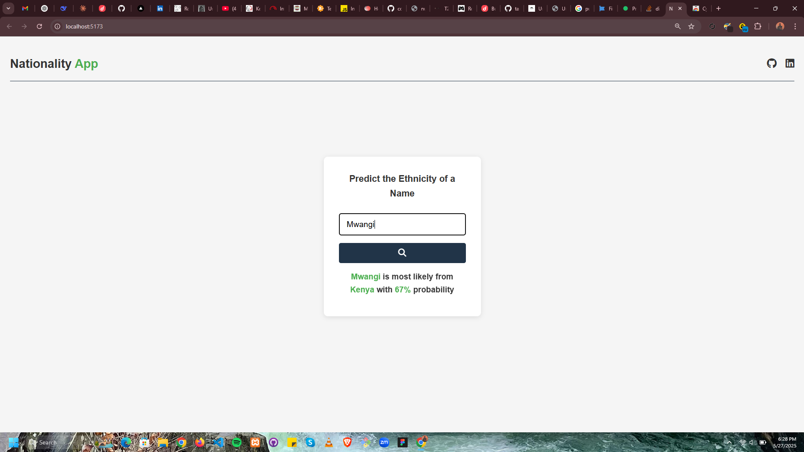

# Nationality Predictor App

A simple application that predicts the likely nationality of a given name using the [nationalize.io](https://nationalize.io) API. Created purely using `HTML`,`CSS` and `JavaScript`.



## Features

- Predict the most likely country of origin using a name
- Display probability percentage
- Responsive User Interface
- Real-time API integration

## How to Use

1. Enter a name in the input field, can be either first or last name
1. Click the search button
1. View the predicted nationality and the probability

## Installation for development and collaboration

1. Fork and Clone this repository:

```bash
git clone https://github.com/sakamw/nationalityApp
```

1. Open the project folder
1. Launch `index.html` in you preferred browser.
